# agent skills

`skills/` の skill を、どう届くかで括る。「毎回回る」はモデルが一覧から読み込む skill。「打って使う」は `disable-model-invocation: true` で一覧から隠し、ユーザーが `/name` (codex は `$name`) と打った時だけ動く skill で、毎セッションの一覧に description を載せない。隠した skill は他の skill からも読み込めないので、そこへ向かう線はユーザーを経由する。実線は「その skill を読み込む」、点線は「必要な時だけ相談する」。

`AGENTS.md` は Claude だけの指示書ではない。`modules/ai/claude.nix` が `~/.claude/CLAUDE.md` に、`modules/ai/agents.nix` が `~/.codex/AGENTS.md` に、同じファイルを配る。毎セッション両 agent が読むので、規則の本文は skill 側に置き、AGENTS.md は「いつ何を読むか」と skill 名だけを持つ。

skill も同じ 2 経路で配る。各 feature が `my.skills` に載せた dir を、claude.nix が `~/.claude/skills/` に、agents.nix が codex 用の `~/.agents/skills/` に並べる (Claude Code は `~/.agents/` を読まない)。`~/.claude/skills/ha` と `~/.claude/skills/agent-browser` がここに無いのはそのためで、前者は flake input `kawarimidoll/ha` 同梱の skill を `modules/git/ha.nix` が、後者は llm-agents.nix の `agent-browser` 同梱の skill を `modules/ai/claude.nix` が `my.skills` に載せている。`mcp-defaults` と `tsgo-lsp` は SKILL.md を持たない Claude plugin なので `~/.claude/skills/` にだけ置く。codex は frontmatter の `name` と `description` しか見ないので、`when_to_use` のトリガー語や `disable-model-invocation`、`hooks` は codex では効かず、隠す skill には `agents/openai.yaml` で同じことを書く。

`rtk` / `ck` / `codegraph` も skill ではなく `modules/ai/agents.nix` が入れるツールで、Claude には `settings.json` の hook と `mcp-defaults` が、codex には `/etc/codex/config.toml` と `~/.codex/hooks.json` が配線する。

`textlint/` は skill ではなく、PR / issue 本文にかける textlint の設定と自前ルール。`modules/ai/_textlint.nix` (claude feature の一部) がこれを `lint-body` と `lint-body-hook` の 2 コマンドに焼き込む。hook は pull-request と issue の frontmatter が skill を呼んだときに登録し、`gh pr create` などの `--body-file` に指摘が残っていればコマンドを止める。

```mermaid
flowchart TD
  subgraph listed["毎回回る (一覧に載る)"]
    direction LR
    implement["implement<br/>TDD で実装する"]
    check["check<br/>lint / test / fmt"]
    commit["commit<br/>Conventional Commits"]
    hr["history-review<br/>pass か rebuild を返す"]
    pr["pull-request<br/>PR 本文を書く"]
    issue["issue<br/>issue を立てる"]
    explain["explain<br/>人が読む文の構造"]
    bv["browser-verify<br/>画面を見る"]
    profile["profile<br/>計測"]
    anchors["anchors<br/>HACK / AIDEV-NOTE の規則と一覧"]
    design["design<br/>設計相談"]
    testdesign["test-design<br/>何をテストするか"]
    rustdoc["rustdoc<br/>Rust の doc (*.rs を触った時だけ)"]
  end

  user(["ユーザーが /name と打つ"])

  subgraph typed["打って使う (一覧から隠す)"]
    direction LR
    reconstruct["reconstruct<br/>最終 diff から積み直す"]
    version["version<br/>次の SemVer"]
    bp["branch-protection<br/>main を保護する"]
    docs["docs<br/>ドキュメント"]
    refactor["refactor<br/>整理の計画"]
    sa["skill-authoring<br/>仕様確認と validator"]
    sc["skill-creator (plugin)<br/>草稿と eval"]
  end

  subgraph tools["ツール (skill ではない)"]
    direction LR
    ab["agent-browser<br/>headless Chrome の CLI"]
    lint["lint-body<br/>本文の textlint (hook も同じ検査)"]
    rtk["rtk<br/>Bash 出力を圧縮する hook"]
    ck["ck<br/>意味で探す grep (MCP)"]
    cg["codegraph<br/>呼び出しと定義のグラフ (MCP)"]
  end

  implement -->|"毎サイクル"| check
  implement -->|"毎サイクル"| commit
  implement -->|"実装が終わった時"| hr
  implement -.->|"画面が変わった時"| bv
  implement -.->|"設計に迷った時"| design
  implement -.->|"何を試すか迷った時"| testdesign
  pr -->|"pre-flight"| hr
  pr -->|"push 前"| check
  pr -->|"本文を書く時"| explain
  pr -->|"やらなかったことを残す時"| issue
  pr -.->|"before / after を撮る時"| bv
  issue -->|"本文を書く時"| explain
  explain -->|"gh に渡す前"| lint
  hr -->|"rebuild なら /reconstruct を案内"| user
  bv --> ab

  user --> reconstruct & version & docs & refactor & sa
  reconstruct -->|"1 commit ずつ"| commit
  version -->|"tag 前"| check
  version -.->|"tag 後は /branch-protection を案内"| bp
  docs -.->|"Rust は /rustdoc を案内"| rustdoc
  refactor -.->|"計画を実行する時"| commit
  sa -->|"草稿と eval"| sc
```

