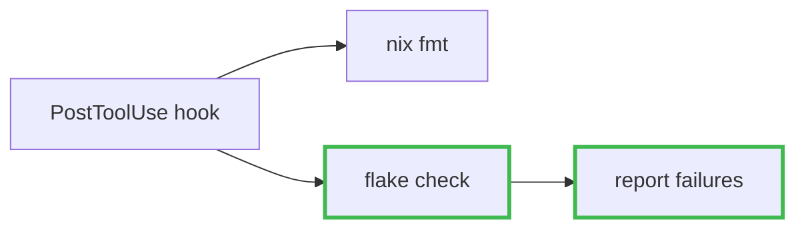

# Mermaid in PR bodies

Read this once the gate in SKILL.md said to draw. It covers three things:
which diagram form fits which change, what breaks GitHub's renderer, and how
to look at the result before publishing it.

## Pick the form from what the change altered

| What the change altered                                            | Form                        | Show                                            |
| ------------------------------------------------------------------ | --------------------------- | ----------------------------------------------- |
| A path something travels — a request, a build, a decision          | `flowchart`                 | the path after the change, changed steps marked |
| Back-and-forth between processes, services, or tools over time     | `sequenceDiagram`           | the exchange, new or removed messages marked    |
| Structure — modules added, imports rewired, responsibilities moved | `flowchart` with `subgraph` | who depends on whom now                         |
| The set of states something can be in                              | `stateDiagram-v2`           | the states, and which transitions are new       |
| A data model or schema                                             | `erDiagram`                 | the entities and the changed relationships      |

If no row fits, the gate was probably wrong for this PR — go back and raise
the altitude of the prose instead of bending a `flowchart` around a change
that has no path in it.

## What goes in the boxes, what goes on the edges

- **Boxes are actors, not files.** A box per changed file with arrows between
  them is decoration. Use the same role names as the やったこと bullets —
  the diagram and the prose should be describing the same picture.
- **The content is often on the edges.** Labelling three arrows
  `テンプレ読み込み` / `変数の解決` / `frontmatter に出自を刻む` says what a
  feature does in a way no arrangement of boxes can. On a refactor where
  most boxes are touched, leave the boxes unmarked and let relabelled edges
  carry the delta.
- **When the diff is all additions**, draw the existing mechanism the new
  code plugs into. Grep for what already references the new paths, or find
  the sibling the new thing was modelled on — that is the attachment point,
  and it is outside the diff. Without it every box is new and marking them
  all says nothing.
- **One grouping axis for `subgraph`s** — either the boundaries things live
  in (core / 画面 / workers), or Before and After. Before/After only when the
  shape genuinely differs; if most nodes would appear on both sides, the
  change is in the wiring, so draw it once and label the edges.

## Marking the change



- `stroke`, never `fill`. GitHub renders under light and dark themes, and a
  fill that reads on white swallows its own label on black.
- The dashes on `removed` carry the same information as the colour, so the
  diagram still works in grayscale and for a red-green colourblind reader.
- Mark only nodes whose existence changed — appeared, disappeared, moved.
  When both classes appear, name them in the caption; a diagram that needs
  a legend it doesn't have is a diagram nobody reads.
- When the new thing is an edge — an existing box now also feeds another
  existing box — mark the edge, not its endpoints: `linkStyle 2
stroke:#3fb950,stroke-width:3px` (edges are numbered from 0 in source
  order). Marking a box that didn't change claims a change that isn't there.

## Keeping it renderable

A block that fails to parse renders as a red error box, which is worse than
no diagram. Verified against mermaid 11:

- **Always quote labels.** `(`, `)`, `[`, `]`, `{`, `}` end an unquoted label
  early. `n["darwin-rebuild (switch)"]` is safe; quoting everything means
  never having to remember which characters are. Inside quotes even `{{prev}}`
  renders as text (checked with mermaid-cli 11) — no need to paraphrase
  template syntax out of a label.
- **Never use lowercase `end` as a node id** — it is a keyword in flowcharts.
  `done`, `finish`, or `End` work.
- **Line breaks** are `<br/>` inside a quoted label, not a literal newline.
- **Size.** Past roughly fifteen nodes GitHub scales the diagram down until
  the labels are unreadable.

## Look at it before publishing

`mmdc` reads the fenced blocks straight out of the body file, so what gets
checked is what gets published:

```bash
export NIXPKGS_ALLOW_UNFREE=1
CHROME=$(nix build --impure --no-link --print-out-paths nixpkgs#google-chrome)
PUPPETEER_EXECUTABLE_PATH="$CHROME/bin/google-chrome-stable" \
  nix run nixpkgs#mermaid-cli -- -i "$BODY" -o /tmp/pr-diagram.png -w 1600 -b white
```

Exit code 1 names the line it choked on. Exit code 0 only means it parsed —
then open the PNG, because the failures that survive the parse are the ones
nothing reports:

- A long edge routed **behind** a node reads as an edge to that node, so the
  diagram asserts a relationship you never wrote. Common when one node fans
  out in `LR`; switch to `TD` or group the targets in a `subgraph`.
- An edge label landing **next to the wrong edge** when several arrows leave
  the same node.
- A diagram GitHub will scale into illegibility.

All three are layout, so restructure and re-render rather than reword. The
first run pulls Chrome (~370 MB) into the store; after that it is instant.
If it cannot run — no network, no `nix` — check against the list above and
say in the report that the diagram is unrendered, so the user glances at the
PR.
