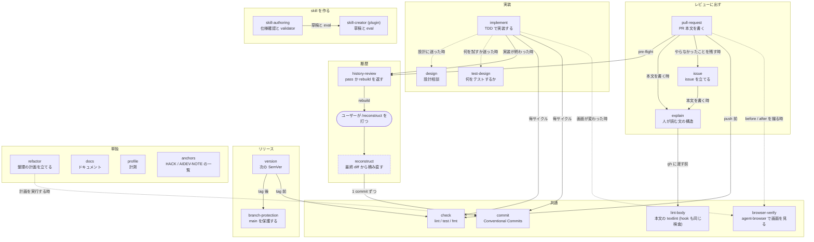

# claude skills

`skills/` の skill がどう呼び合うか。実線は「その skill を読み込む」、点線は「必要な時だけ相談する」。`reconstruct` だけはモデルから隠れていて、ユーザーが `/reconstruct` と打った時にしか動かない。

`~/.claude/skills/ha` と `~/.claude/skills/agent-browser` はここに無い。前者は flake input `kawarimidoll/ha` 同梱の skill を `modules/git/ha.nix` が、後者は llm-agents.nix の `agent-browser` 同梱の skill を `modules/ai/claude.nix` がそのまま置いている。

`textlint/` は skill ではなく、PR / issue 本文にかける textlint の設定と自前ルール。`modules/ai/_textlint.nix` (claude feature の一部) がこれを `lint-body` と `lint-body-hook` の 2 コマンドに焼き込む。hook は pull-request と issue の frontmatter が skill を呼んだときに登録し、`gh pr create` などの `--body-file` に指摘が残っていればコマンドを止める。

