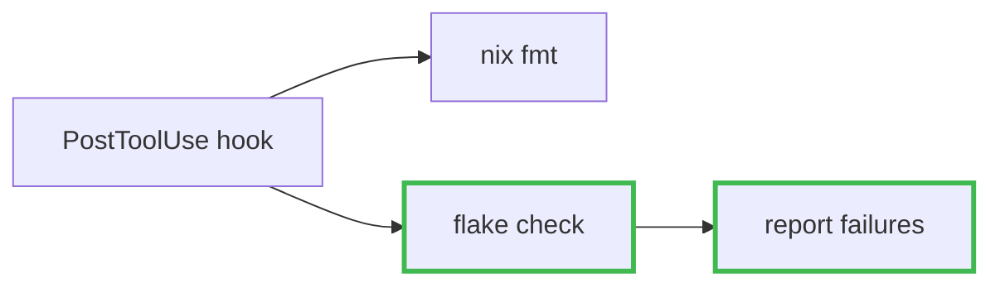

# Pull requests

A reviewer opens a PR knowing nothing. GitHub already shows them the raw diff, so a
description that restates the diff wastes their time. The body's job is to give them
the two things the diff cannot: **why this change exists** and **what shape it has**.

That is what the mermaid diagram and the file table are for. The diagram carries the
shape; the table carries the scope and the reason each file was touched. Both are
mandatory. The risk in a mandatory diagram is padding — inflating a one-sentence
observation into a six-box flowchart because a diagram was required. A small diagram
is a correct answer. Most of the guidance below is about earning the diagram rather
than filling the slot.

## Pre-flight

1. **Base.** Ask the repo instead of assuming, and fetch so the base ref is current:

   ```bash
   BASE=$(gh repo view --json defaultBranchRef --jq .defaultBranchRef.name)
   git fetch origin "$BASE"
   ```

2. **Branch.** Run `git branch --show-current`. If it is not the default branch you are
   fine. If it is, what to do depends on where the work already sits — and getting this
   wrong is the one mistake here that produces a confidently empty PR.

   - **Still uncommitted**: `git switch -c <type>/<short-slug>` (`feat/tsgo-lsp`,
     `fix/zen-codesign`) carries the working tree over; step 3 handles committing.
   - **Already committed onto the default branch**: creating a branch is not enough.
     The local default branch still points at those same commits, so the diff against
     it comes back empty and the PR would have no content:

     ```bash
     git switch -c <type>/<short-slug>       # new branch keeps the commits
     git branch -f "$BASE" "origin/$BASE"    # local default branch back to the remote
     ```

3. **Uncommitted work.** Run `git status --short`. If anything relevant is dirty, ask
   the user whether to commit it first; a PR that omits half the change invites a
   review of the wrong thing. Use the `commit` skill for the message. Leave unrelated
   untracked files alone and say later that you did.

4. **Confirm the range is not empty** before writing a word:

   ```bash
   git diff --stat "origin/$BASE...HEAD"
   ```

   Empty output means the branch does not actually differ from the base — usually step
   2 gone wrong, sometimes a fetch that moved the base past you. Stop and fix it. An
   empty PR with a beautifully written body is worse than no PR.

Verify and push come _after_ the body is written — see "Verify, push, create". Checks
like `nix flake check` take minutes and tell you nothing you need in order to write
the body, so running them here just stalls the work.

If a PR already exists for this branch (`gh pr view --json number,title,body`), you
are updating it: compose the body as below, then `gh pr edit` instead of
`gh pr create`.

## Read the change before describing it

You cannot pick a diagram or explain a file without knowing what happened:

```bash
git diff --stat "origin/$BASE...HEAD"      # scope: files and line counts
git log --oneline "origin/$BASE..HEAD"     # the commit subjects
git log --format='%s%n%b' "origin/$BASE..HEAD"   # the bodies — this is where the why is
git diff "origin/$BASE...HEAD"             # the actual change
```

Two details that decide whether the numbers in your body are true:

- **Three dots** (`origin/$BASE...HEAD`) diffs against the merge base. Two dots would
  fold in whatever landed on the base after you forked, attributing other people's
  work to your PR.
- **`origin/$BASE`, not `$BASE`.** A stale local base makes your `**Total:**` line
  disagree with what GitHub renders on the PR, which is the kind of small wrongness
  that costs a reviewer's trust in the whole body.

Commit bodies are the best source for the _why_ — they were written with the context
loaded. Lift the motivation from them rather than re-deriving it from the code.

Lift, but check each claim against the diff before repeating it. A commit body is the
author's understanding at the time, and it drifts: it may describe an intent the commit
only partly carried out, or state something as a consequence of the change that was
already true beforehand. "The separate `typescript` package is now unnecessary" reads
like a removal, and repeating it puts a removal in your Summary — but if the diff is
`-0` and that package was never there, you have just told the reviewer something false
on the author's authority. When a body claims something happened, find it in the diff,
or check the parent (`git show <commit>^:<path>`) to see whether it was already so.

When there are no commit bodies to lift from — bot branches from Renovate or
Dependabot typically have none — the _why_ is genuinely not in the repository. Go to
the actual source: upstream release notes (`gh api repos/OWNER/REPO/releases`), the
changelog, the tool's own config (`.github/renovate.json5`). Say what you checked and
what you concluded. Do not fill the gap with plausible-sounding rationale; a bot bump
whose body is invented is worse than one that says "upstream's release notes list no
breaking change that reaches this repo, see below".

## Title

Conventional Commits. The `commit` skill has the type and description rules; this
repo's scope table lives in its `CLAUDE.md`. One thing differs here: a PR title
covers the **whole branch**, so a multi-commit branch needs a decision the commit
rules don't make.

- **Single commit**: reuse its subject verbatim.
- **Scope**: as in the `commit` skill — one scope if all paths map to it, the majority
  scope if one covers most of them, omitted if the branch is genuinely split.
- **Type**: not the plurality — the type of the most consequential change for someone
  downstream. A branch of three refactors plus one new capability is a `feat`, because
  that is what a reader of the history and any release tooling need to see. Bury the
  `feat` under `refactor` and the change becomes invisible. The genuinely hard case is
  a new artifact that only relocates behaviour that already worked: a new file is not a
  `feat` if nothing new became possible, so that is a `refactor`. When the call is
  arguable, make it and say why in a Summary bullet so a reviewer can dispute it —
  a defended judgment beats a coin flip presented as fact.
- **Description**: describe what the branch achieves, not the operations it performed.
  `move global instructions into auto-triggered skills` tells a reviewer what is now
  true; `delete 3 skills, add 1, edit CLAUDE.md` makes them reconstruct it. If you
  cannot get the branch into one line, that is real evidence it should be split, and
  worth saying to the user rather than papering over with a vague title.

## Body template

Four sections, in this order:

````markdown
## Summary

- <why this change exists, then what it does — one bullet per logical change>

## Diagram

<one-line caption naming what the diagram shows and what moved>

```mermaid
<diagram>
```

## Files changed

| File           | Change   | Why                                  |
| -------------- | -------- | ------------------------------------ |
| `path/to/file` | +12 / -3 | <what this file's edit accomplishes> |

**Total:** N files, +X / -Y

## Test plan

- [x] <a check you actually ran, with the result you observed>
- [ ] <a check nobody has run yet>
````

### Summary

Lead each bullet with the motivation, not the mechanism. `Consolidate the three
overlapping check skills into verify to remove duplicated command discovery` tells a
reviewer why to expect deletions; `Delete test.md, format.md, static-analysis.md`
makes them go find out.

If the change carries a risk worth naming — it bets on an assumption, it deletes
something on the belief that it is now redundant, it can fail silently — that belongs
here as its own bullet. It is usually the single most useful sentence in the body, and
it has no other home in this template. "This deletes global instructions on the bet
that the harness already covers them; if that bet is wrong, nothing goes red" is what
a reviewer most needs to be told.

### Files changed

The `Why` column is the point of the table. GitHub already prints file names and line
counts, so a two-column version adds nothing; one clause per row on what that edit
accomplishes is what makes it worth reading.

Past roughly fifteen files a row-per-file table stops being scannable. Group by
directory or module, total each group, and name individually only the files where the
interesting decisions live:

```markdown
| Area                             | Files | Change     | Why                                             |
| -------------------------------- | ----- | ---------- | ----------------------------------------------- |
| `modules/home-manager/programs/` | 6     | +140 / -12 | New program modules for the tsgo toolchain      |
| `configs/claude/skills/`         | 2     | +80 / -0   | Skill definitions those modules link into place |
```

Lock files and generated churn (`flake.lock`, `_sources/`, vendored deps) go on one
collapsed row with a note, never expanded — that is volume, not content.

### Test plan

The boxes mean something specific, and the meaning is what makes the section
trustworthy:

- **`[x]`** — you ran it and observed the result. Write the result.
- **`[ ]`** — nobody has run it. It is a request to the reviewer, or a note that CI
  will cover it, or a check you were unable to run.

Never write a result you did not observe, in either kind of box. If a check couldn't
run, leave it unchecked and say why in the same line — `darwin-rebuild switch not run
(no sudo in this session)` is useful; a checked box implying it passed is a lie the
reviewer will act on.

Those rules make honesty easy and effort optional, so the lazy-compliant output is a
plan of all-unchecked boxes. That is a worse PR, and usually it isn't even true: most
changes have cheap checks available right now, and an all-unchecked plan means you
didn't look. The ones that almost always exist:

- **Does the edited config still parse?** `jq empty <file>`, `nix flake check --no-build`,
  `yq`, `--dry-run` — seconds, and catches the most embarrassing class of breakage.
- **Did anything dangle?** After a rename or delete, `git grep` for the old name across
  the repo. This is the check that catches half-finished refactors.
- **Is a claim in your own Summary true?** If you wrote that a tightened default reaches
  nothing here, the `rg` that proves it is a check — run it and record it.
- **Does the diagram render?** You are running `mmdc` anyway; it counts.

Reserve `[ ]` for what genuinely needs the reviewer, a rebuild, or CI.

## Choosing the diagram

There is no default type, because the right one depends on what changed. Ask what
relationship the change altered, then pick the form that shows it:

| What the change altered                                                   | Diagram                     | Show                                                     |
| ------------------------------------------------------------------------- | --------------------------- | -------------------------------------------------------- |
| A path something travels — request handling, a build pipeline, a decision | `flowchart`                 | the path after the change, with the changed steps marked |
| Back-and-forth between processes, services, or tools over time            | `sequenceDiagram`           | the exchange, with new or removed messages marked        |
| Structure — modules added, imports rewired, files moved                   | `flowchart` with `subgraph` | who depends on whom now                                  |
| The set of states something can be in                                     | `stateDiagram-v2`           | the states, and which transitions are new                |
| A data model or schema                                                    | `erDiagram`                 | the entities and the changed relationships               |

**If no row fits, don't force the nearest one.** A version bump alters no relationship,
and a pure addition alters none either; both have their own sections below — jump to
"When almost nothing changed" or "When the diff is all additions" now rather than
bending a `flowchart` of pipeline stages around a change that has none. Forcing a row
here is how the padded six-box diagram gets built.

Then two checks.

**Does it say something the bullets don't?** A box per changed file with arrows
between them is decoration — it looks like information and isn't. Find the
relationship that actually moved: the call that now goes somewhere else, the step that
disappeared, the dependency that reversed. Often the content belongs on the _edges_
rather than in the boxes — labelling three arrows `command discovery`,
`branch management`, `anti-stall loop` says what a refactor did in a way no
arrangement of file names can.

**Can a reviewer see the change in it?** A picture of the end state doesn't say what
moved. Mark what changed, and distinguish gained from lost:



Emphasize with `stroke`, not `fill`. GitHub renders mermaid under both light and dark
themes, and a hardcoded fill that reads well on white can swallow its own label on
black. A thicker stroke reads on both. The dashes on `removed` carry the same
information as the colour, so the diagram still works in grayscale and for a
red-green colourblind reader. When both classes appear, say which is which in the
caption — a diagram needing a legend it doesn't have is a diagram nobody reads.

**Mark only the nodes whose existence changed** — appeared, disappeared, or moved. The
temptation is to mark everything you touched, and marking everything conveys exactly
nothing: the marks only mean something against unchanged context. On a migration where
most boxes are affected, the honest delta is usually in the _edges_, so leave the
boxes unmarked and let the relabelled arrows carry it.

Pick **one** grouping axis for `subgraph`s — either the boundaries things live in, or
`Before` and `After`. Both at once needs nested subgraphs and blows the node budget for
no gain. Before/After earns its place when the shape genuinely differs. It goes wrong
when a thing exists on both sides: duplicating it into both halves says it changed when
it didn't, and now the diagram is lying. If most nodes would appear twice, the change is
in the wiring — draw it once and label the edges. Skip Before/After entirely on a pure
addition, where the `Before` half would be an empty box.

### When the diff is all additions

"What relationship changed?" answers "none — some files appeared", and following the
table mechanically gives you a box per new file: exactly the decoration the gate is
meant to catch.

Diagram the **existing mechanism the new code plugs into**. Four new files that look
unrelated in a diffstat usually cohere completely once you see the layer they attach
to, and that layer is outside the diff — so go find it. Two searches get you there:

- **Grep the repo for the new paths and identifiers.** Whatever already references the
  directory you added files to, or already spawns the binary you installed, is the
  attachment point. A new file under `configs/claude/skills/` means something links
  `configs/claude/skills` somewhere; find that and you have the mechanism.
- **Look for a sibling already doing the same thing.** New things are nearly always
  modelled on an existing one. Find the sibling and its wiring is your diagram, with
  your addition alongside it — and the comparison often surfaces the most interesting
  sentence in the body, like the fact that another tool already runs the same server.

Keep enough of that unchanged mechanism in the diagram for the new nodes to read as a
delta against it. This is the case where including context is not padding: without it,
every box is new, and marking them all says nothing at all.

### When almost nothing changed

A version bump or a typo fix has no relationship to draw, and no amount of looking
will produce one. Draw the small true thing — the value that changed and what consumes
it — and stop. Two or three nodes is the right size, and inflating it to look
substantial is the failure mode here, not a small diagram.

The gate is "don't draw the file list", never "the diagram must be large". If you find
yourself hunting for something a diagram could depict, you have already found the
answer: there isn't much, so say that briefly and move on. Anything you discover that
is worth more than a diagram — that the tightened behaviour in the new major doesn't
reach this repo, say — belongs in a Summary bullet, and it does not also need a
picture.

## Keeping mermaid renderable

A diagram that fails to parse renders as a red error box, which is worse than no
diagram. The failures, verified against mermaid 11:

- **Brackets in labels.** `(`, `)`, `[`, `]`, `{`, `}` end an unquoted label early and
  break the parse. Quoting fixes every one of them, so just always quote:
  `n["darwin-rebuild (switch)"]`. `:`, `,`, `;` and `#` are safe either way — quoting
  regardless means never having to know which is which.
- **`end` as a node id.** Lowercase `end` is a keyword and breaks flowcharts. Use
  `done`, `finish`, or capitalize it. (Hyphens and dots in ids are fine.)
- **Line breaks.** `<br/>` inside a quoted label, not a literal newline.
- **Size.** Past roughly fifteen nodes GitHub scales the diagram down until the labels
  are unreadable. If it doesn't fit, you are drawing the system instead of the change.

Don't rely on reading it carefully — render it. Point `mmdc` at the body file itself;
it finds the fenced blocks, needs nothing installed, and does not modify the input:

```bash
export NIXPKGS_ALLOW_UNFREE=1
CHROME=$(nix build --impure --no-link --print-out-paths nixpkgs#google-chrome)
PUPPETEER_EXECUTABLE_PATH="$CHROME/bin/google-chrome-stable" \
  nix run nixpkgs#mermaid-cli -- -i "$BODY" -o /tmp/pr-diagram.png -w 1600 -b white
```

Checking the body rather than a copy of the block is what makes this worth doing — it
validates the thing you are actually about to publish, so an edit after validation
can't slip through.

Read two things from the output:

- **The exit code.** 0 renders, 1 doesn't, and stderr names the line it choked on. Fix
  and re-run until it passes.
- **The `Found N mermaid charts in Markdown input` line.** A body with no diagram at all
  exits 0 with `No mermaid charts found` — so the exit code alone will happily bless a
  body that forgot the mandatory diagram. Confirm N is what you expect.

Then look at the PNG. Parsing and being readable are different bars, and a diagram
GitHub has scaled into illegibility passes the first while failing the reviewer.

`mmdc` rasterizes through a headless browser, which is why Chrome is involved; handing
it over via `PUPPETEER_EXECUTABLE_PATH` keeps this inside `nix run` instead of letting
puppeteer fetch its own browser into `~/.cache`. `google-chrome` is unfree, hence
`NIXPKGS_ALLOW_UNFREE` and `--impure`. The first run pulls roughly 370 MB into the
store, then is instant.

If the check genuinely can't run — no network, no `nix` — check the diagram against the
list above and say in your report that it is unvalidated, so the user knows to glance at
the rendered PR.

## Verify, push, create

Write the body somewhere outside the worktree so a later `git add -A` can't swallow it:

```bash
BODY=$(mktemp -d)/pr-body.md
# write the body to "$BODY", then validate its diagram as above
```

Now that the body exists, run the project's checks via the `verify` skill. Sending a PR
that fails its own repo's `fmt`/`check` burns a review round on nothing — and running
it here rather than in pre-flight means the slow part overlaps with work already done.

**Then go back and update the Test plan.** You just ran checks whose results the body
claims are unknown, and the body is still a file on disk — so turn those into `[x]`
boxes with what you observed. Skipping this ships a PR that says `nix flake check` was
never run ninety seconds after watching it pass, which is exactly the kind of stale
honesty that teaches reviewers to ignore the section.

```bash
git push -u origin HEAD
gh pr create --base "$BASE" --title "<title>" --body-file "$BODY"
gh pr checks --watch
```

Pass the body with `--body-file`; `--body` mangles newlines and the mermaid fence.

`gh pr checks --watch` blocks until CI settles and exits non-zero on failure — never
`sleep` and poll. If the repo reports no checks the command errors out; that is not a
failure, so note it and move on.

When checks fail, read the failing job (`gh run view <id> --log-failed`) and report
what broke. Fix it if the cause is in this branch; ask first if the fix would widen
the PR beyond what the user asked for.

## Reporting back

Give the user the PR URL, the title, and the CI outcome. Say explicitly what you left
out — uncommitted files the user declined to commit, a check that couldn't run, a
diagram you couldn't validate. A PR the user believes is complete when it isn't is the
one failure mode here that costs more than the skill saves.
