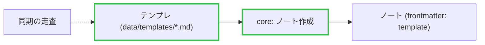

# Pull requests

GitHub already shows the reviewer the diff. The body's job is to convey what
the diff cannot: **why this change exists**, **what shape it has**, and
**what was deliberately left out**. Restating the diff only makes the body
longer and wastes the reviewer's time. Brevity is courtesy, not laziness.

## Pre-flight

1. **Base and branch:**

   ```bash
   BASE=$(gh repo view --json defaultBranchRef --jq .defaultBranchRef.name)
   git fetch origin "$BASE"
   git branch --show-current
   ```

   If you are on the default branch, you need to branch off. With uncommitted
   work, `git switch -c <type>/<slug>` carries the working tree over. **If the
   work is already committed onto the default branch**, creating a branch is
   not enough — the local default still points at those commits, so the diff
   comes back empty and the PR has no content:

   ```bash
   git switch -c <type>/<slug>
   git branch -f "$BASE" "origin/$BASE"
   ```

2. **Uncommitted changes:** ask the user whether to include them, then commit
   via the `commit` skill. A PR that omits half the change invites a review of
   the wrong thing.

3. **Confirm the range:** read `git log --oneline "origin/$BASE..HEAD"`. Empty
   means step 1 went wrong. Unfamiliar commits are the user's unpushed work —
   don't silently include them, don't silently drop them; ask.

Check for an existing PR with `gh pr view`; if one exists, use `gh pr edit`
instead of `gh pr create`.

## Read the change first

Read before writing. Use three dots (merge-base comparison) — two dots would
attribute other people's post-fork changes on the base to your PR:

```bash
git diff --stat "origin/$BASE...HEAD"
git log --format='%s%n%b' "origin/$BASE..HEAD"   # commit bodies hold the why
git diff "origin/$BASE...HEAD"
```

A large diff overflows the Bash output cap and gets truncated silently.
Past a few hundred lines, write it to a file under `$(mktemp -d)` and Read
it in pieces — what you didn't see doesn't make it into the body.

Commit bodies are the primary source for the _why_, but verify their claims
against the diff before repeating them. On bot branches (Renovate etc.) with
no bodies, go read the upstream release notes. Never invent a
plausible-sounding rationale.

## Title

Conventional Commits. Type and scope rules come from the `commit` skill and
the repo's CLAUDE.md. A single-commit branch reuses its subject verbatim. A
multi-commit branch gets one line for what the branch achieves — not a list of
operations. If it won't fit in one line, that is evidence the branch should be
split; say so to the user.

## Body

The body is written in Japanese, in this format:

```markdown
## なぜやるか

<この変更が必要な理由。issue があれば closes #123 で引用>

## やったこと

<図を入れる場合はここに。1 行のキャプション + mermaid>

- <何が新しくできるようになったか / 何が変わったか、役割の言葉で>

## やらなかったこと

- <あえてスコープ外にしたこと、次に回したこと>

## 資料

- <参考リンク、issue、議論>
```

- **なぜやるか** is the core of the body. If the motivation lives in a commit
  body, lift it from there.
- **やったこと** is a map of the change, not a table of contents for the
  diff. GitHub already shows file lists and line counts. See "Altitude" below.
- **やらなかったこと** is the most valuable section when you can write it —
  stating "this is out of scope" saves the reviewer from wondering whether to
  flag it. If there is truly nothing, drop the section. Never leave an empty
  section.
- **資料** — likewise, drop it if there are no links.

### Altitude

Write やったこと one level above the diff. The reader has not opened the diff
yet; they are deciding whether to, and where to look first. A bullet that
only makes sense with the diff open is at the wrong altitude.

- **Name things by their role, not their identifier.** 「テンプレの読み書き
  を core に足した」 reads without the repo open; 「`template/` に
  `read_template` / `create_from_template` を足した」 does not. Identifiers
  are pointers, not content — at most one per bullet, in parentheses, and
  only when the reviewer will want to jump there. (This budget is for
  やったこと; なぜやるか names whatever the problem is about, and a type
  mismatch is about the type.)
- **Say what became true, not what was done.** 「同じテンプレの今日のノート
  があれば作らず開く」 is a behavior the reviewer can check; 「重複判定を
  追加」 is an operation they have to reverse-engineer.
- **Counts and measurements stay when they are the reason.** 「21 箇所の
  写経を 1 つのヘルパーに」 justifies a refactor; a list of the 21 call
  sites does not.
- **Sub-bullets are a smell.** A bullet with three or more sub-bullets is
  the diff's table of contents creeping back. Either the parent bullet
  already says enough, or the structure wants a diagram.
- **Preparatory commits get one bullet, together.** A feature branch
  usually carries a refactor or two that made the feature possible. Fold
  them into a single 「先に構造を直した」 bullet that says why they were
  needed; they don't go in the diagram, and listing each one is the diff
  again.

The test: a teammate on a different project should be able to read every
bullet and understand what changed. If they would need the diff, raise the
altitude; if they would still need the diff after that, that is what the
diff is for.

### Length

Japanese does not wrap, so line counts hide length — count characters.
The whole body fits in one screen: なぜやるか in two or three sentences,
one sentence per やったこと bullet (a second only when the reason is not
obvious from the first), one line per やらなかったこと. Outside the
diagram, stay under ~600 characters; past ~900 you are narrating something
the diff or the diagram already shows. A bullet that needs a second
sentence to explain its first is usually two bullets, or a diagram edge.

Drawing is a way to delete text. The bullets under a diagram get shorter
because the structure moved into the picture; if the body is as long with
the diagram as it would be without, the diagram is decoration.

### Diagrams

A diagram earns its place by showing **relationships** — which parts now talk
to which, what step appeared or disappeared — and prose is bad at exactly
that. "Only when the architecture changed" turned out to be a gate that never
opens: a feature that adds a module, a pipeline stage, and a screen is
architecture too, but it never feels like it from inside the diff. So the
gate is a count, not a judgment. Draft やったこと once, count on that
draft, decide; if you draw, the bullets get rewritten to sit under the
diagram, and that rewrite does not reopen the decision.

1. **Count the actors** whose exchange the change touched — modules,
   processes, services, screens, external systems, and the data that flows
   between them. An unchanged neighbour counts only when it is an endpoint
   of a new, removed, or rerouted exchange. **Three or more** means the
   reviewer is assembling a picture from text. Draw the exchange.
2. **Check the length.** If やったこと runs past ~6 bullets (sub-bullets
   included), the body past ~600 characters, or it carries more than ~10
   backtick identifiers, the text is doing a diagram's job. Either draw,
   or raise the altitude until the count drops. Both are correct answers;
   leaving it as is, is not.

Two actors or fewer — a version bump, a config tweak, a typo fix, a single
function change — gets no diagram. A forced diagram is decoration that looks
like information, and it costs the body its credibility.

When you draw:

- Put it at the top of やったこと with a one-line caption saying what the
  reader should see in it. The bullets below then explain, not enumerate.
- Draw the change, not the system. Keep only enough unchanged context for the
  new parts to read as a delta. Past ~15 nodes you are drawing the system.
- Mark what appeared or disappeared with a stroke class, and say which is
  which in the caption. Mark nothing else — marks only mean something
  against unchanged neighbours.



Read `references/mermaid.md` before writing the block. It has the diagram
type per kind of change, the syntax that breaks GitHub's renderer, and how to
render the body locally to catch layout that parses but lies.

## Verify, hand off the push, create

Write the body outside the worktree so a later `git add -A` can't swallow it:

```bash
BODY=$(mktemp -d)/pr-body.md
```

Before the push, run the project's checks via the `verify` skill. A PR that
fails its own repo's fmt/check burns a review round on nothing.

`git push` is deny-listed on purpose — the user pushes. If the branch is not
on the remote yet, hand over the exact command with the real branch
substituted, in the form `! git push -u origin <branch>`, and continue once
they have run it:

```bash
gh pr create --base "$BASE" --title "<title>" --body-file "$BODY"
gh pr checks --watch
```

Use `--body-file`, not `--body` (which mangles newlines and mermaid fences).
If `gh pr create` is denied too, that is the user's decision, not an obstacle
to route around — hand that command over the same way.

## Report

Give the user the PR URL, the title, and the CI outcome. State explicitly what
you left out — files not committed, checks that couldn't run, a diagram you
could not render. A PR that looks complete but isn't is the most expensive
failure here.

Then ask whether any of the やらなかったこと should become issues, and
recommend which — the ones that are follow-up work in this repo, not the
ones that are out of scope for good. On yes, file them with the `issue`
skill's deferred-work template, one per item, linking back to the PR. The
reason each was left out is already written; the issue is where it survives
the merge.
